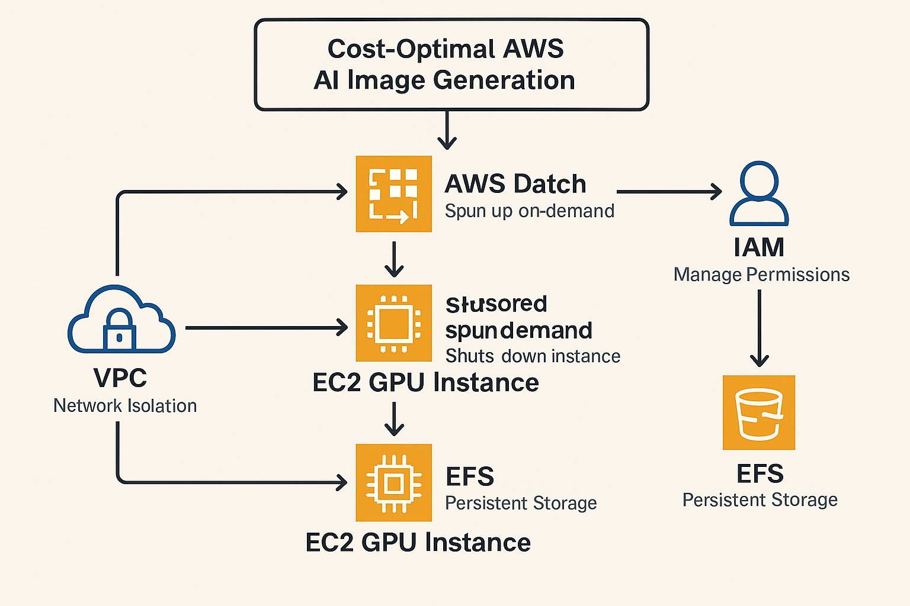

# Cost-Optimal AWS AI Image Generation

A proof of concept for running open-source AI image generation in a cost-effective way using AWS Batch.


## Overview

This project provides an infrastructure-as-code solution to deploy [Fooocus](https://github.com/lllyasviel/Fooocus), an open-source image generation tool, on AWS in a pay-as-you-go model using AWS Batch. Instead of running expensive GPU instances 24/7, this solution:

1. Spins up GPU instances on-demand when image generation is requested
2. Shuts down instances automatically after a configurable idle period
3. Stores generated images persistently in EFS
4. Provides a simple CLI interface to submit generation jobs

## Architecture preview



The solution uses the following AWS services:

- **AWS Batch**: Manages the compute resources and job scheduling
- **ECR**: Stores the Docker image containing Fooocus
- **EFS**: Provides persistent storage for generated images
- **VPC**: Network infrastructure for secure deployment
- **IAM**: Manages permissions for AWS resources

## Prerequisites

- AWS CLI installed and configured
- Terraform >= 0.13.0
- Docker installed (for building the container image)
- jq (optional, for parsing outputs)

## Deployment Instructions

### 1. Initialize Terraform

```bash
cd terraform
terraform init
```

### 2. Configure Variables

Edit `terraform/variables.tf` or create a `terraform.tfvars` file to customize the deployment. Key variables include:

- `instance_type`: GPU instance type (default: g4dn.xlarge)
- `max_vcpus`: Maximum vCPUs to scale to
- `idle_timeout_seconds`: How long an instance stays idle before being terminated
- `job_timeout_seconds`: Maximum runtime for a job

### 3. Deploy Infrastructure

```bash
terraform apply
```

Upon completion, Terraform will output:

- ECR repository URL
- Batch job queue ARN
- Batch job definition ARN
- Example job submission command

### 4. Build and Push Docker Image

```bash
# Get ECR repository URL from Terraform output
ECR_REPO=$(terraform output -raw ecr_repository_url)

# Build and push Docker image
cd ../scripts
./build-docker.sh us-east-1 $ECR_REPO
```

## Using the System

### Submitting a Job

Use the provided script to submit image generation jobs:

```bash
./submit-job.sh \
  <job_queue_name> \
  <job_definition_name> \
  "a cat sitting on a chair, oil painting style" \
  "/output" \
  "blurry, low quality"
```

Parameters:

- `job_queue_name`: AWS Batch job queue name
- `job_definition_name`: AWS Batch job definition name
- `prompt`: Text prompt for image generation
- `output_path`: Path where to store images (usually "/output")
- `negative_prompt`: (Optional) Text to avoid in the generation

### Retrieving Generated Images

Generated images are stored in the EFS file system. You can access them by:

1. Mounting the EFS to an EC2 instance
2. Using AWS DataSync to copy files to S3
3. Implementing a simple retrieval API (not included in this PoC)

## Cost Optimization

This solution optimizes costs in several ways:

1. **Pay only for what you use**: GPU instances run only when jobs are being processed
2. **Automatic scaling**: Scales from 0 to max_vcpus based on workload
3. **Idle timeout**: Instances shut down after a configurable idle period
4. **Spot instances**: (Optional) Can be configured to use spot instances for additional savings

Estimated cost for generating 100 images per month:

- ~$0.70/hour for g4dn.xlarge (on-demand pricing)
- ~1-2 minutes per image generation
- Total: ~$2-3 per month

## Customization Options

### Using Different Models

To use a different AI model, modify the Dockerfile and entry_point.py script. The infrastructure remains the same.

### Scaling Up

For higher throughput:

- Increase `max_vcpus` in variables.tf
- Use more powerful GPU instances (e.g., g4dn.2xlarge)
- Adjust concurrency settings in AWS Batch

### Adding API Access

This PoC provides CLI-based job submission. To add API access:

- Deploy an API Gateway + Lambda function to submit jobs
- Create a simple retrieval API to access generated images

## Troubleshooting

### Common Issues

1. **Job stuck in RUNNABLE state**:

   - Check that the ECR image exists and is accessible
   - Verify there are available resources in the compute environment

2. **Job fails with container error**:

   - Check CloudWatch Logs for the job's task
   - Ensure the GPU driver is compatible with the container

3. **Cannot access generated images**:
   - Verify EFS mount targets are in the correct subnets
   - Check security group rules allow NFS traffic

## Security Considerations

This deployment includes:

- VPC isolation
- Least-privilege IAM policies
- Security groups restricting access

For production use, consider:

- Encryption for EFS volumes
- VPC endpoints for AWS services
- More restrictive security groups

## License

[MIT License](LICENSE)

## Contributing

Contributions are welcome! Please feel free to submit a Pull Request.
